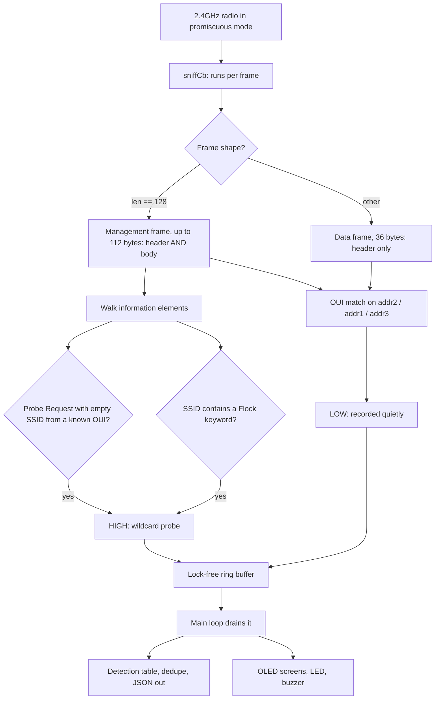

# HW364A Flock Sniffer

A passive Flock Safety surveillance-camera detector that runs on a $5 ESP8266 board with a built-in
OLED screen. It listens to the air, tells you when a camera is nearby, and transmits nothing at all.

Built for the **HW-364A** (and its micro-USB twin the HW-364B): an ESP8266 dev board with a 0.96"
SSD1306 display soldered on. Total cost of the hardware is under ten dollars.

```
FLOCK-MINI  CH:6            FLOCK DETECTED
------------------          ------------------
    Scanning...             70:c9:4e:1a:2b:3c
   2 in range               WPROBE  -62dBm
  high:1  low:7             CLOSE  ch6  x14
------------------          ------------------
12m04  38k    RX            12m04  38k    RX
```

---

## Why this exists

Flock Safety operates a large network of automated licence-plate readers. Their cameras are usually
mounted on poles, uplink over LTE, and are not obvious to a passer-by. The community has worked out
that they are identifiable by their radio behaviour, and several detectors already exist for the
ESP32.

This project ports that work to the cheapest hardware that can do the job, and to the specific board
that already has a screen attached, so the result is a self-contained device rather than something
tethered to a laptop.

## What it detects, and how confident it is

Detections are graded, because not every signature means the same thing.

**High confidence, triggers an alert:**

- **Wildcard probe request.** Flock cameras channel-hop and spray 802.11 Probe Requests with an
  empty SSID element roughly every 125 ms, looking for their uplink. A zero-length SSID element from
  a known Flock hardware prefix is a tight signature. Field-tested by DeFlock Joplin at 11 of 12
  cameras with 2 false positives.
- **SSID keyword.** A beacon or probe response whose network name contains `flock`, `flck`,
  `fs ext battery`, `penguin`, or `pigvision`.

**Low confidence, recorded silently:**

- **OUI match** on the transmitter, the receiver, or the BSSID address of any frame. Matching on the
  *receiver* address is the clever part, discovered by @NitekryDPaul: these cameras sleep most of the
  time, so a transmitter-only sniffer misses them, but you can still see a nearby access point
  sending frames *to* them.

The low tier is quiet by design. Of the 32 hardware prefixes in the community list, `a4:cf:12`,
`3c:71:bf` and `08:3a:88` belong to Espressif and `e4:aa:ea` to Liteon — contract manufacturers whose
chips are in millions of ordinary devices. A bare prefix match on those is a lead, not a camera.

## What it cannot do

**No Bluetooth.** The ESP8266 has no BLE radio. Upstream's Bluetooth detection path (Flock
manufacturer ID `0x09C8`, "Penguin" devices) is impossible on this chip. If you need that, use an
ESP32 and run [flock-you](https://github.com/colonelpanichacks/flock-you) directly.

**No GPS or logging to card.** Detections live in RAM and clear on reboot. The serial JSON stream is
the permanent record. This is deliberate — ESP8266 flash writes stall the radio and drop frames. The
table holds 64 devices; once full, a high-confidence hit recycles the stalest low-confidence entry
rather than being dropped.

**RSSI is not distance.** CLOSE/NEAR/FAR is a hint. Walls, poles, and antenna orientation swing it
by tens of decibels.

---

## Hardware

| Part | Detail |
|---|---|
| Board | HW-364A (USB-C) or HW-364B (micro USB), ESP8266 with onboard SSD1306 |
| Display | 0.96" 128x64 SSD1306, I2C address `0x3C`, **SDA = GPIO14, SCL = GPIO12** |
| Buzzer | Optional passive piezo on GPIO5 |
| Button | The onboard FLASH button on GPIO0 |
| Power | Any USB power bank |

Two traps with this board. The silkscreen labels are unreliable, so the firmware only ever uses raw
GPIO numbers. And some units ship with SDA and SCL physically swapped, so the firmware probes both
pin orders at boot and reports which one worked. GPIO6 through GPIO11 are wired to the flash chip
and cannot be used for anything.

## Install

Full beginner walkthrough: [docs/START-HERE.md](docs/START-HERE.md). Short version, from a clone:

```powershell
git clone https://github.com/Sid3b00m/HW364A-Flock-Sniffer.git
cd HW364A-Flock-Sniffer
pip install platformio
python -m platformio run -t upload
python -m platformio device monitor -b 115200
```

You need the [CH340 driver](https://sparks.gogo.co.nz/ch340.html) on Windows first, and a USB cable
that carries data. Upload at 115200; these clones drop uploads at higher speeds.

Other routes:

- **Windows one-click:** `install.ps1` handles PlatformIO, port detection, build and flash, and drops
  a Desktop shortcut. See [docs/INSTALL.md](docs/INSTALL.md).
- **GUI:** `flock_installer.py` is a small tkinter window over the same steps.
- **Browser, no toolchain:** [**sid3b00m.github.io/HW364A-Flock-Sniffer/web/**](https://sid3b00m.github.io/HW364A-Flock-Sniffer/web/)
  flashes the prebuilt binary straight from Chrome or Edge over Web Serial. Built with
  [ESP Web Tools](https://esphome.github.io/esp-web-tools/); see [docs/WEBFLASH.md](docs/WEBFLASH.md)
  to host your own copy.

## Using it

**Scan screen** — current channel, how many devices are in range right now, running totals as
`high:N low:N`, uptime and free heap.

**Alert screen** — pops up for four seconds on a new high-confidence hit: MAC, method, signal, range,
channel, hit count, SSID if there was one.

**List screen** — everything seen this session, newest first. `HI` and `lo` mark the confidence tier;
`<` means still in range.

**Button** — tap to page through the list, hold one second to mute alerts.

**Serial** at 115200 emits one JSON object per detection, in the same shape upstream's Flask
dashboard consumes:

```json
{"event":"detection","detection_method":"wifi_wildcard_probe","confidence":"high",
 "protocol":"wifi_2_4ghz","mac_address":"70:c9:4e:1a:2b:3c","oui":"70:c9:4e",
 "rssi":-62,"channel":6,"frequency":2437,"ssid":"","hits":14}
```

Plus a heartbeat every 30 seconds:

```
[flock-mini] ch=6 seen=9 high=1 drops=0 heap=38240
```

## Proving it works

Full detail in [docs/TESTING.md](docs/TESTING.md). Two levels:

**Logic.** A second build environment runs a set of hand-built 802.11 frames through the real
sniffer at boot and prints PASS/FAIL over serial, with no radio involved, so the result is the same
every time:

```powershell
python -m platformio run -e hw364a-selftest -t upload
python -m platformio device monitor -b 115200
```

**Radio.** That proves parsing, not reception. Set `SELFTEST_OUI` in `flock-mini.ino` to the first
three bytes of your phone's WiFi MAC, reflash, and toggle the phone's WiFi. Phones emit the same
wildcard probe requests cameras do, so a `FLOCK DETECTED` reading `WPROBE` proves the entire
high-confidence path end to end. Comment it out afterwards.

Cheaper smoke test: any ESP-based smart plug or bulb nearby will trip the low tier within a minute,
which confirms capture, matching, hopping and display.

---

## How it works inside



The promiscuous callback does almost nothing: match, then push into a single-producer
single-consumer ring buffer. All the slow work — string formatting, serial writes, I2C to the
display — happens in the main loop, so the WiFi task is never blocked.

Channel hopping covers 1, 6 and 11 with a 350 ms dwell, matched to the ~125 ms probe interval.

### Engineering notes

Four things that were not obvious, recorded so the next person does not lose an afternoon.

**1. The ESP8266 promiscuous buffer is shaped by length, and it is easy to get backwards.** `len == 12`
is metadata only. `len == 128` is `sniffer_buf2`: a *management* frame with up to 112 bytes, header
and body. Anything else is `sniffer_buf`: a *data* frame, 36 bytes, header only. The existing ESP8266
port has these two cases swapped, so it only ever tries to parse information elements out of data
frames — which means its highest-confidence wildcard-probe detector can never fire. This project
branches the other way. Note also that `sniffer_buf2` ends with *two* 16-bit fields, `cnt` then
`len`, so the real frame length is at offset 126 and not 124.

**2. Do not filter locally-administered MACs.** The obvious hygiene step of skipping MACs with bit 1
of the first octet set (they are usually randomised) throws away `82:6b:f2`, a confirmed camera
prefix — and specifically the one that was added to the list because the original thirty missed a
real camera in the field.

**3. The 112-byte cap is survivable.** The ESP8266 truncates frames at 112 bytes, which sounds fatal
for parsing. It is not, because the SSID element is the *first* element in a probe request and comes
immediately after the 24-byte header. The data we need always arrives before the truncation point.

**4. The Arduino build injects prototypes above your code.** Function prototypes are generated and
placed at the top of the `.ino`, before your own type definitions. Any function taking a custom
struct fails to compile with a baffling "does not name a type". Shared types therefore live in
`flock_sigs.h`. Relatedly, the core does not export the SDK's `RxControl`, so the firmware defines
its layout explicitly with a `static_assert` on the 12-byte size, turning a would-be silent
garbage-data bug into a compile error.

## Repository layout

```
flock-mini.ino        firmware: sniffer, detection table, OLED UI
flock_sigs.h          OUI list, SSID keywords, shared types
platformio.ini        build config for the ESP8266
install.ps1           Windows one-click installer
flock_installer.py    GUI installer (tkinter)
docs/                 START-HERE, INSTALL, TESTING, WEBFLASH, installer docs
web/                  browser flasher (ESP Web Tools)
FIRMWARE.md           the same firmware as one annotated document
```

`FIRMWARE.md` is a literate copy of the two source files, which is how the Windows installer can
bootstrap a build on a machine that has nothing but this document. It is the canonical copy:
`install.ps1` regenerates `flock-mini.ino` and `flock_sigs.h` from it unless you pass `-KeepSource`.
Edit the `.ino` directly for experiments, edit `FIRMWARE.md` for changes you intend to keep.

## Credits

This project stands almost entirely on other people's research.

- **[@NitekryDPaul](https://github.com/DeflockJoplin/flock-you/blob/main/datasets/NitekryDPaul_wifi_ouis.md)**
  — the 30 original OUI prefixes and the receiver-address technique for catching sleeping cameras.
- **Michael / DeFlock Joplin** — the 31st prefix and the wildcard-probe signature, drive-tested.
- **[colonelpanichacks/flock-you](https://github.com/colonelpanichacks/flock-you)** — the original
  firmware and the research that started it.
- **[LuxStatera/flock-hunter-d1-mini-wifi](https://github.com/LuxStatera/flock-hunter-d1-mini-wifi)**
  — the first ESP8266 port, and the reference this one was written against.
- **[GhostESP](https://docs.ghostesp.net/latest/wifi/flock-detection/)** — the confidence-tier model.
- **[deflock.me](https://deflock.me)** — crowdsourced map of known camera locations.

## Legal

This is a passive receiver. It does not transmit, deauthenticate, jam, associate, or interfere with
any network. It reads 802.11 management frames that are already being broadcast unencrypted, in the
same sense that a scanner radio listens to public airwaves.

Laws differ by jurisdiction. Check yours. This is published for education and research.

## Licence

MIT.
